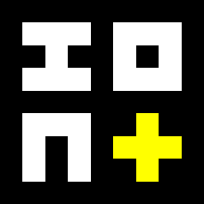

# Ion

Ion is a minimalist protocol for serializing structured data.

## Supported types

| Index | Kind | Name  | Size | Format                   | Purpose                                                     |
|-------|------|-------|------|--------------------------|-------------------------------------------------------------|
| 0x00  | u0   | void  | 0    | /                        | Represents void, null, None                                 |
| 0x01  | u8   | byte  | 1    | u8:self                  | Represents 8 bit numbers, boolean, char and Ion object kind |
| 0x02  | u16  | short | 2    | u16:self                 | Represents 16 bit numbers                                   |
| 0x03  | u32  | int   | 4    | u32:self                 | Represents 32 bit numbers                                   |
| 0x04  | u64  | long  | 8    | u64:self                 | Represents 64 bit numbers, pointers                         |
| 0x05  | arr  | array | 16+  | u8:item;u8:size;[object] | Represents arrays, strings, tuples                          |
| 0x06  | list | list  | 8+   | u8:size;[object]         | Represents lists                                            |

Object kinds are represented using their index in u8 type. \
Every object is serialized as `kind;self`.

### Example

| Object        | Serialized                   |
|---------------|------------------------------|
| "hello world" | [050B68656C6C6F20776F726C64] |
| (u16) 1337    | [020539]                     |
